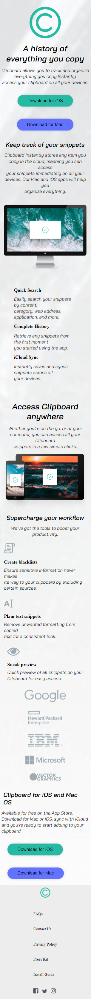
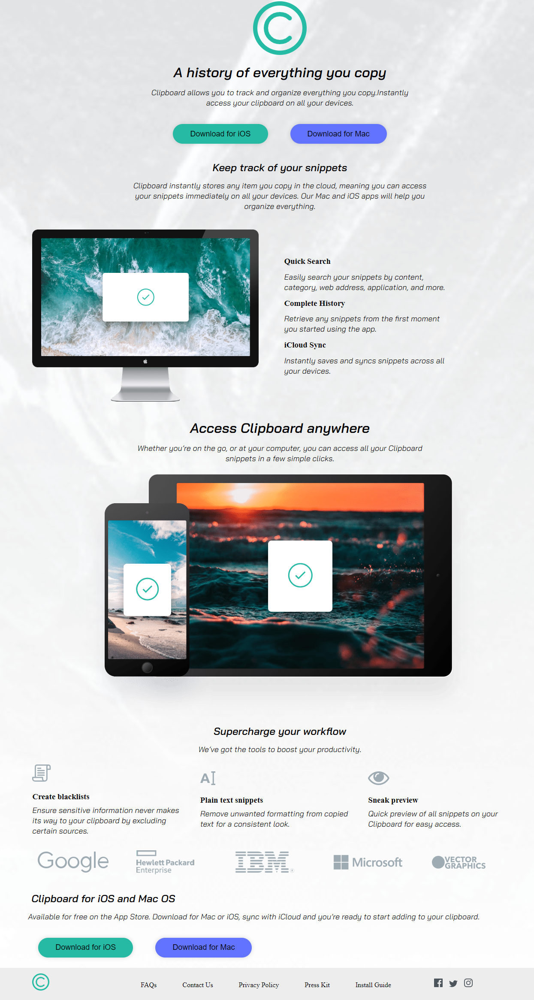

# Welcome

Thanks for checking out this front-end mentor Challenge solution

This is a solution to the [Clipboard landing page challenge on Frontend Mentor](https://www.frontendmentor.io/challenges/clipboard-landing-page-5cc9bccd6c4c91111378ecb9). Frontend Mentor challenges help you improve your coding skills by building realistic projects.

## Screenshot

.

## The challenge

To Do this challenge you need basic understanding of HTML & CSS

Your challenge is to build out this landing page and get it looking as close to the design as possible.

You can use any tools you like to help you complete the challenge. So if you've got something you'd like to practice, feel free to give it a go.

Users should be able to:

- View the optimal layout for the site depending on their device's screen size
- See hover states for all interactive elements on the page

## Where to find everything

Your task is to build out the project to the designs inside the `/design` folder. You will find both a mobile and a desktop version of the design.

The designs are in JPG static format. Using JPGs will mean that you'll need to use your best judgment for styles such as `font-size`, `padding` and `margin`.

You will find all the required assets in the `/images` folder. The assets are already optimized.

There is also a `style-guide.md` file containing the information you'll need, such as color palette and fonts.

## Building your project

Feel free to use any workflow that you feel comfortable with. Below is a suggested process, but do not feel like you need to follow these steps:

1. Initialize your project as a public repository on [GitHub](https://github.com/). Creating a repo will make it easier to share your code with the community if you need help. If you're not sure how to do this, [have a read-through of this Try Git resource](https://try.github.io/).
2. Configure your repository to publish your code to a web address. This will also be useful if you need some help during a challenge as you can share the URL for your project with your repo URL. There are a number of ways to do this, and we provide some recommendations below.
3. Look through the designs to start planning out how you'll tackle the project. This step is crucial to help you think ahead for CSS classes to create reusable styles.
4. Before adding any styles, structure your content with HTML. Writing your HTML first can help focus your attention on creating well-structured content.
5. Write out the base styles for your project, including general content styles, such as `font-family` and `font-size`.
6. Start adding styles to the top of the page and work down. Only move on to the next section once you're happy you've completed the area you're working on.

### Built with

- Semantic HTML5 markup
- CSS custom properties
- Flexbox
- CSS Grid
- Desktop-first workflow

### Useful resources

- [MDN Documentation](https://developer.mozilla.org/en-US/)

- [W3schools](https://www.w3schools.com/)

### Deploying Your Project

There are many ways to host your project for free. My recommend hosts is:

- [GitHub Pages](https://pages.github.com/)

### Sharing your solution

There are multiple places you can share your solution:

- Submit it on the platform so that other users will see your solution on the site. Other users will be able to give you feedback, which could help improve your code for the next project.

- Tweet [Frontend-Mentor](https://www.frontendmentor.io) mention @frontend-mentor including the repo and live URLs in the tweet. We'd love to take a look at what you've built and help share it around.

## Author

- GitHub - [Leonard Munene](https://github.com/LeonardMunene)
- Frontend Mentor - [@yourusername](https://www.frontendmentor.io/profile/LeonardMunene)

### Giving feedback

Feedback is always welcome, so if you have any to give on this challenge please telegram hi[at](https://t.me/Leonad4)

This challenge is completely free. Please share it with anyone who will find it useful for practice.

**Have fun building!** 🚀
